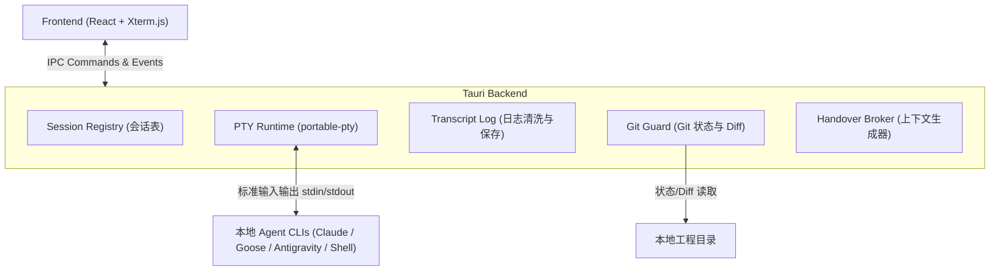
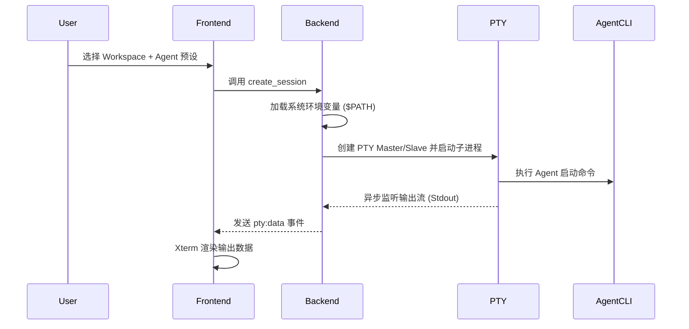
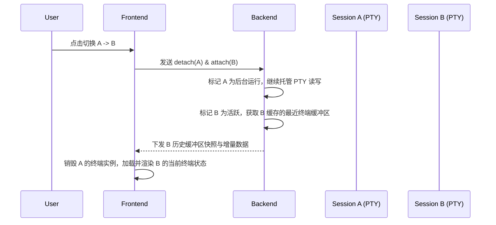
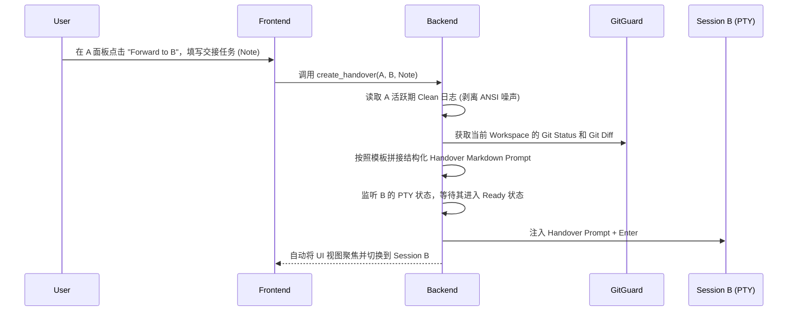

# AgentRelay 架构与流程设计简明文档

本文件提供 AgentRelay MVP 的高层技术架构与核心业务流程设计，去除了具体代码实现细节。

---

## 1. 项目定位与核心概念

AgentRelay 是一个桌面端本地 Agent 会话路由器（Orchestrator / Router）。

### 核心概念
* **Workspace（工作空间）**：本地项目目录，通常是 Git 仓库，由多个 Agent 会话共享。
* **Agent Preset（预设）**：描述 Agent CLI 工具的启动命令、参数与交互注入策略。
* **Session（会话）**：在 Rust 后端托管的独立 PTY 进程，与特定的 Agent 绑定。
* **Handover（交接协议）**：将源会话的最新上下文（输入输出日志、Git 状态、修改 Diff）及用户说明，安全注入至目标会话的机制。

---

## 2. 整体技术架构

AgentRelay 采用前后端分离的本地桌面架构，Rust 后端作为状态的“唯一真相来源”，前端 React 只做终端渲染与交互操作。

### 关键组件职责
1. **Frontend (React + Xterm.js)**：
   * 负责 Session 列表、工作区管理和 Handover 交互界面。
   * 渲染由 Rust 转发的 PTY 终端流（Xterm 实例），只充当“薄客户端”。
2. **Tauri Backend (Rust)**：
   * **Session Registry**：管理所有会话的生命周期。
   * **PTY Runtime**：管理独立的 PTY 子进程，包括读写线程、终端大小调整（Resize）和退出监控。
   * **Transcript Log**：双轨日志记录。Raw 日志用于终端回放；Clean 日志（剥离 ANSI 样式、只保留纯文本和输入标记）用于 LLM 上下文。
   * **Git Guard**：实时获取工作区的 Git Status、Git Diff 以及执行 Patch 备份。
   * **Handover Broker**：编排交接流程，拼接系统 Handover Prompt，并将数据安全推送到目标进程。

---

## 3. 核心业务流程

### 3.1 会话创建流程
创建会话是启动本地 Agent 进程的底层支撑，其核心是建立 PTY 管道与进程托管。

---

### 3.2 会话切换与保活流程
当用户在不同 Agent 之间切换时，被切走的 Agent 进程保持运行状态，其内存与上下文不会丢失。

---

### 3.3 跨 Agent 上下文交接流程 (Handover)
在 A 进程不退出的情况下，将 A 的上下文转发给 B 进程继续执行。

---

## 4. 关键技术机制设计

### 4.1 环境变量继承机制
由于 macOS 等系统下桌面 GUI 应用默认不继承用户 Shell 配置文件（如 `.zshrc`）的 `$PATH`，后端在启动 PTY 前，会通过在后台静默执行一次登录 Shell（如 `zsh -l -c "env"`）来捕获完整的用户环境变量，并动态注入到子进程的运行上下文中，确保能够成功拉起本地全局安装的 Agent 工具。

### 4.2 终端日志清洗与回放 (双轨设计)
* **回放轨 (Raw Buffer)**：完整记录 ANSI 逃逸控制符，在用户重新 attach 会话时，一次性写入 Xterm.js，以恢复彩色渲染、光标位置及交互状态。
* **解析轨 (Clean Transcript)**：过滤进度条、格式控制符等噪声，并标记 `[User Input]` 与 `[Agent Output]`。只在交接（Handover）或导出报告时作为纯文本塞给 LLM，防止 Token 浪费及理解偏差。

### 4.3 写入互斥与并发保护
虽然底层支持多 Agent 对同一工作区并行动作，但为防止文件写入冲突，AgentRelay 遵循**“单写多读”提示原则**。同一工作空间下存在多个活跃 Session 时，前端将予以醒目的“并写警告”，提示用户谨慎交替执行写文件任务。
