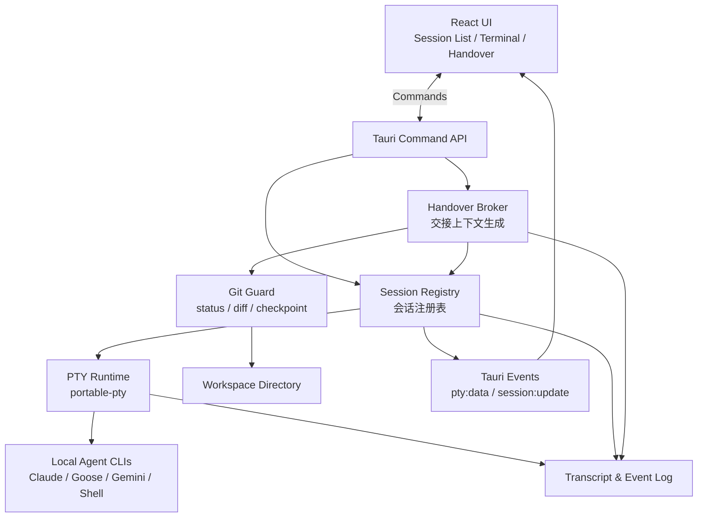
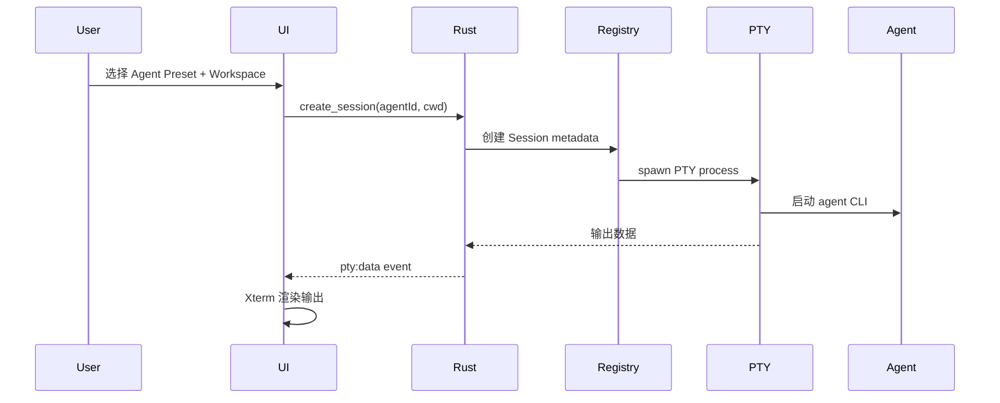
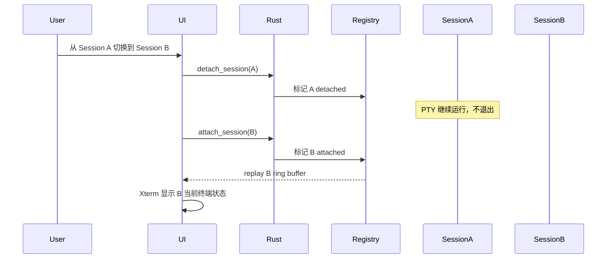
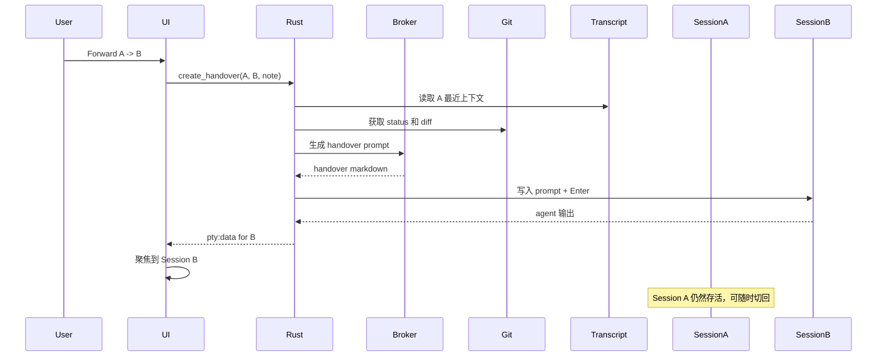
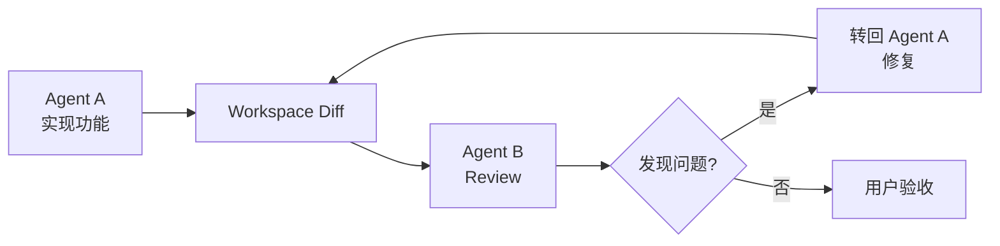
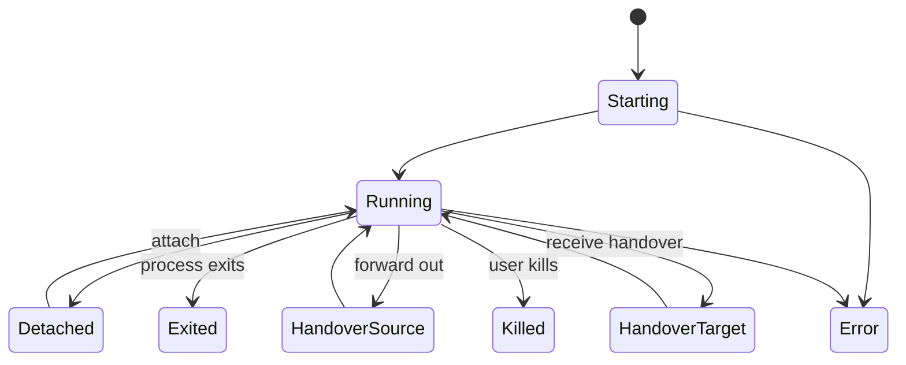

# AgentRelay MVP 技术方案

## 1. 项目定位

AgentRelay 是一个桌面端本地 Agent CLI 编排器，用于启动、保持、切换和转发多个本机 AI Agent CLI 会话，例如 Claude Code、Goose、Gemini CLI、自定义 Shell Agent 等。

它的核心目标不是简单地启动一个 agent，而是让多个本地 agent 的 PTY 会话长期存活，让用户可以在这些会话之间切换，并把一个 agent 的上下文、代码 diff、任务状态转发给另一个 agent 继续执行。

一句话定位：

```text
AgentRelay 是一个本地 Agent 会话路由器，而不是普通 Agent Launcher。
```

## 2. MVP 核心目标

MVP 需要实现以下能力：

1. 多 Agent 会话保活

   每个 agent CLI 都运行在独立 PTY 中。用户切换 UI 时，PTY 进程不退出，agent 自身的上下文和交互状态不丢失。

2. 一次会话多次 chat

   同一个 agent session 可以持续多轮输入输出，保持 CLI 自身的上下文、工作目录和运行状态。

3. 跨 Agent 转发

   用户可以将 Agent A 的当前上下文、最近 transcript、workspace git diff、任务说明整理成 handover prompt，注入到 Agent B。Agent A 不会被关闭，之后仍可切回继续使用。

4. 本地 workspace 感知

   AgentRelay 能读取当前 workspace 的 git status、git diff、分支信息，用于生成交接上下文。

5. Agent CLI 适配

   不同 CLI 的启动方式、输入方式、ready 状态不同，MVP 需要通过 Agent Preset 做基础抽象，而不是把 Claude、Goose、Gemini 的细节写死在业务逻辑里。

## 3. 推荐技术栈

```text
Desktop Shell:
  Tauri v2 + Rust

Frontend:
  React + TypeScript
  @xterm/xterm
  @xterm/addon-fit
  CSS / TailwindCSS 可选

PTY:
  portable-pty

State:
  Rust side session registry
  JSON / JSONL event log for MVP
  后续可升级为 SQLite

IPC:
  Tauri Commands: 用户输入、resize、创建会话、handover 等控制动作
  Tauri Events: PTY 输出流、session 状态变化、错误事件
```

技术栈选择理由：

```text
Tauri + Rust:
  适合做轻量桌面端、本地进程管理、文件系统访问和 git 操作。

portable-pty:
  适合管理真实交互式终端，可支持 readline、TUI、agent CLI 等交互场景。

React + Xterm:
  前端只负责渲染 terminal 和工作台 UI，不承载核心 session 状态。
```

## 4. 核心架构



核心原则：

```text
1. Rust backend 是 session 状态的唯一真相来源。
2. Frontend 只负责展示、输入和用户操作。
3. 每个 agent session 是独立 PTY 进程。
4. Handover 是事件，不是进程替换。
5. Source session 在 handover 后继续存活。
```

## 5. 产品概念模型

### 5.1 Workspace

Workspace 表示一个本地工作目录，通常对应一个 git repository。

```ts
type Workspace = {
  id: string
  path: string
  name: string
  gitEnabled: boolean
  currentBranch?: string
}
```

### 5.2 AgentPreset

AgentPreset 描述一个 agent CLI 的启动方式和输入策略。

```ts
type AgentPreset = {
  id: string
  name: string
  command: string
  args: string[]
  env?: Record<string, string>
  defaultCwd?: string
  readyPatterns?: string[]
  injectionStrategy: "paste-enter" | "stdin-arg" | "custom"
}
```

示例配置：

```json
[
  {
    "id": "shell",
    "name": "System Shell",
    "command": "/bin/zsh",
    "args": ["-l"],
    "injectionStrategy": "paste-enter"
  },
  {
    "id": "claude",
    "name": "Claude Code",
    "command": "claude",
    "args": [],
    "injectionStrategy": "paste-enter"
  },
  {
    "id": "goose",
    "name": "Goose",
    "command": "goose",
    "args": [],
    "injectionStrategy": "paste-enter"
  }
]
```

### 5.3 Session

Session 表示一个活跃或历史的 PTY 会话。

```ts
type Session = {
  id: string
  workspaceId: string
  agentId: string
  title: string
  cwd: string
  status: "starting" | "running" | "exited" | "error"
  createdAt: number
  lastActiveAt: number
  attached: boolean
}
```

### 5.4 Handover

Handover 表示一次从 source session 到 target session 的上下文转发。

```ts
type Handover = {
  id: string
  sourceSessionId: string
  targetSessionId: string
  workspaceId: string
  createdAt: number
  prompt: string
  gitStatus: string
  gitDiff: string
  transcriptWindow: string
  status: "drafted" | "injected" | "failed"
}
```

## 6. 后端模块设计

建议 Rust 后端目录结构如下：

```text
src-tauri/src/
├── main.rs
├── commands.rs
├── session_registry.rs
├── pty_runtime.rs
├── agent_preset.rs
├── handover.rs
├── git_guard.rs
├── transcript.rs
└── app_state.rs
```

### 6.1 session_registry.rs

职责：

```text
create_session(agent_id, cwd)
list_sessions()
attach_session(session_id)
detach_session(session_id)
write_session(session_id, data)
resize_session(session_id, cols, rows)
kill_session(session_id)
get_session_snapshot(session_id)
```

设计要点：

```text
Session Registry 不直接做阻塞 IO。
每个 PTY session 自己有 reader thread 和 writer channel。
HashMap 只保存 session handle 和 metadata。
切换 session 时只改变 attach 状态，不销毁 PTY 进程。
```

### 6.2 pty_runtime.rs

职责：

```text
启动 PTY 进程。
读取 PTY 输出。
向 PTY 写入用户输入。
处理 terminal resize。
监听 child process 退出。
维护 terminal ring buffer。
```

每个 session 包含：

```text
PTY master
PTY child process
reader thread
writer handle
ring buffer
transcript writer
resize handle
```

输出流处理：

```text
PTY output -> ring buffer -> transcript log -> Tauri event -> frontend xterm
```

输入流处理：

```text
Frontend input -> Tauri command -> PTY writer -> transcript input log
```

### 6.3 transcript.rs

职责：

```text
记录每个 session 的 input/output。
记录 handover、session start、session exit 等关键事件。
为 handover 提供最近上下文窗口。
为 terminal attach 提供最近 buffer replay。
```

MVP 可使用 JSONL：

```json
{"ts":1710000000,"session_id":"s1","type":"input","data":"npm test\n"}
{"ts":1710000001,"session_id":"s1","type":"output","data":"..."}
{"ts":1710000030,"type":"handover","source":"s1","target":"s2"}
```

建议保存两类内容：

```text
Raw PTY log:
  用于 terminal replay 和排查问题。

Semantic event log:
  用于 handover、review loop、历史记录。
```

### 6.4 git_guard.rs

职责：

```text
读取 workspace git 状态。
为 handover 生成 diff 上下文。
可选创建 patch checkpoint。
```

MVP 支持：

```text
git rev-parse --show-toplevel
git branch --show-current
git status --porcelain=v1
git diff
git diff --staged
```

可选 checkpoint：

```text
.agentrelay/checkpoints/<handover_id>.patch
```

MVP 不建议默认自动 commit。自动 commit、自动 branch 可以作为用户开启的高级选项。

### 6.5 handover.rs

职责：

```text
从 source session 读取最近 transcript。
读取 workspace git status 和 git diff。
结合用户 note 生成 handover prompt。
将 prompt 注入 target session。
记录 handover event。
```

Handover prompt 模板：

````markdown
# Handover

You are continuing work from another local agent session.

## Goal
{user_goal}

## Source Agent
{source_agent_name}

## Target Agent
{target_agent_name}

## Workspace
- Path: {workspace_path}
- Branch: {branch}
- Git Status:
{git_status}

## What Has Been Done
{summary_or_recent_transcript}

## Current Diff
```diff
{git_diff}
```

## Next Steps
{next_steps}

## Instructions
- Continue from the current workspace state.
- Do not revert unrelated user changes.
- Preserve existing user edits.
- Ask before destructive operations.
````

## 7. 前端模块设计

建议目录结构：

```text
src/
├── App.tsx
├── main.tsx
├── components/
│   ├── AppShell.tsx
│   ├── Sidebar.tsx
│   ├── TerminalView.tsx
│   ├── SessionTabs.tsx
│   ├── HandoverModal.tsx
│   ├── AgentPresetPanel.tsx
│   └── WorkspacePicker.tsx
├── hooks/
│   ├── useSessions.ts
│   ├── useTerminalSession.ts
│   └── useHandover.ts
├── api/
│   └── tauri.ts
└── types.ts
```

UI 布局建议：

```text
左侧 Sidebar:
  Workspace
  Agent Presets
  Active Sessions

中间主区域:
  TerminalView
  当前 session 状态
  attach/detach 状态

顶部或底部操作区:
  New Session
  Forward / Handover
  Kill Session
  Resize 自动处理
```

产品形态应更像：

```text
多 agent 工作台 + terminal router + handover 控制台
```

而不是普通 terminal app 或 marketing landing page。

## 8. IPC 设计

### 8.1 Frontend -> Rust Commands

```ts
create_session(agentId, workspacePath)
list_sessions()
attach_session(sessionId)
detach_session(sessionId)
write_session(sessionId, data)
resize_session(sessionId, cols, rows)
kill_session(sessionId)

list_agent_presets()
validate_agent_preset(agentId)

get_git_status(workspacePath)
create_handover(sourceSessionId, targetSessionId, userNote)
inject_handover(handoverId)
```

### 8.2 Rust -> Frontend Events

```ts
"pty:data"
"session:created"
"session:updated"
"session:exited"
"session:error"
"handover:created"
"handover:injected"
"git:status-updated"
```

PTY data event 示例：

```ts
type PtyDataEvent = {
  sessionId: string
  data: string
}
```

注意事项：

```text
PTY 输出是高频事件，需要 chunk 化。
Frontend 切换 session 时要清理旧 listener。
TerminalView unmount 时必须 dispose xterm 和 event listener。
```

## 9. 核心流程

### 9.1 创建 Agent Session



### 9.2 切换 Session，但进程不退出



### 9.3 Handover：A 转发给 B，A 不死



### 9.4 Review Loop



Review Loop 是 AgentRelay 后续最有价值的产品形态之一：

```text
Claude 实现 -> Goose Review -> Claude 修复 -> Gemini 总结 -> 用户验收
```

## 10. 会话生命周期



状态说明：

```text
Running:
  PTY 进程活着，可以读写。

Detached:
  UI 不显示这个 session，但 PTY 继续运行。

HandoverSource:
  作为上下文来源，不会被关闭。

HandoverTarget:
  接收 handover prompt 的 session。
```

## 11. MVP 实施阶段

### Phase 1: 项目初始化

目标：

```text
搭建 Tauri v2 + React + TypeScript 项目。
接入 @xterm/xterm。
实现基础桌面窗口。
```

交付：

```text
可以打开桌面应用。
页面里有一个空 terminal 容器。
```

### Phase 2: 单 PTY Terminal MVP

目标：

```text
Rust 启动 /bin/zsh。
Xterm 显示输出。
用户输入能写入 PTY。
支持 resize。
```

验收：

```text
能运行 ls、vim、top、nano。
窗口 resize 后 terminal 布局正常。
```

### Phase 3: 多 Session 保活

目标：

```text
支持创建多个 shell session。
支持 session 切换。
切走的 session 不退出。
```

验收：

```text
Session A 执行 read name。
切到 Session B 执行命令。
切回 A 后 read 仍在等待输入。
```

这是整个产品的第一块地基。

### Phase 4: Agent Presets

目标：

```text
支持配置 Claude / Goose / Gemini / Shell。
检测 command 是否存在。
允许用户设置 absolute path。
```

验收：

```text
能从 UI 启动 Claude Code 或 Goose。
agent 多轮 chat 不因切换 session 丢上下文。
```

### Phase 5: Transcript 与 Event Log

目标：

```text
后端记录每个 session 的 input/output。
保存最近 terminal buffer。
支持 session attach 时 replay。
```

验收：

```text
刷新前端后，Rust 里的 session 仍在。
重新 attach 可以看到最近输出。
handover 能读取最近 transcript。
```

### Phase 6: Handover MVP

目标：

```text
A -> B 转发。
A 不退出。
B 收到 handover prompt。
handover prompt 包含用户 note、recent transcript、git status、git diff。
```

验收：

```text
Agent A 修改文件。
Forward to Agent B。
Agent B 能理解当前进度并继续。
切回 Agent A 后，A 仍然可用。
```

### Phase 7: Git Checkpoint 和 Review Loop

目标：

```text
handover 前生成 patch checkpoint。
支持 A 实现、B review、A 修复的循环。
```

验收：

```text
可以查看每次 handover 对应的 diff。
可以导出 handover prompt。
可以追踪 review loop 历史。
```

## 12. 关键技术风险与应对

### 风险 1: 不同 Agent CLI 行为不一致

问题：

```text
有些 CLI 是 readline。
有些 CLI 是 TUI。
有些支持 --prompt。
有些必须等 ready 后才能输入。
```

应对：

```text
引入 AgentPreset / AgentAdapter。
MVP 默认使用 paste-enter 策略。
后续给 Claude、Goose、Gemini 做专门 adapter。
```

### 风险 2: macOS GUI app 找不到 PATH

问题：

```text
用户 terminal 里能运行 claude，但 Tauri app 里可能找不到。
```

应对：

```text
MVP 提供 command 检测。
支持 absolute executable path。
可尝试从 login shell 读取 PATH。
Settings 里显示每个 agent 的可用状态。
```

### 风险 3: 关闭窗口后 PTY 是否还活着

MVP 定义：

```text
应用运行期间，PTY 不灭。
关闭窗口默认 hide 到 tray。
用户显式 Quit 时才关闭所有 session。
```

后续高级版：

```text
把 PTY runtime 拆成 daemon。
桌面 UI 只是 client。
```

### 风险 4: 多个 agent 同时修改同一个 workspace

问题：

```text
Agent A 和 Agent B 同时写文件可能冲突。
```

MVP 应对：

```text
允许多个 session，但 UI 提醒同 workspace 多 writer 风险。
handover 前记录 git diff。
不默认自动 commit。
```

高级方案：

```text
每个 agent 使用独立 git worktree。
最后由用户 merge。
```

### 风险 5: Transcript 不是干净对话

问题：

```text
PTY 输出包含 ANSI、进度条、TUI 控制字符。
直接塞给另一个 agent 可能很脏。
```

MVP 应对：

```text
先使用最近 N KB raw transcript。
清理部分 ANSI 控制符。
加上 git diff 和用户 note，降低 transcript 质量依赖。
```

后续增强：

```text
引入摘要器。
区分 user input、agent output、tool output。
生成结构化 handover summary。
```

## 13. MVP 验收清单

```text
[ ] 可以创建多个 PTY session
[ ] session 切换不会导致进程退出
[ ] xterm 输入输出正常
[ ] resize 正常
[ ] 可以启动 shell / claude / goose / gemini
[ ] 可以检测 agent command 是否存在
[ ] 后端保存 session transcript
[ ] attach session 时可以 replay 最近 buffer
[ ] 可以读取 workspace git status / diff
[ ] 可以生成 handover prompt
[ ] 可以将 handover prompt 注入 target session
[ ] source session 在 handover 后仍然存活
[ ] 可以完成一次 A -> B -> A 的 review loop
```

## 14. 推荐的第一版实现顺序

第一版最应该优先证明的不是能不能启动 Claude，而是：

```text
多个 PTY agent session 能同时活着，
用户可以随时切换，
handover 只是把上下文注入另一个活 session，
不会破坏原 session。
```

推荐顺序：

```text
MVP-1: 多 PTY session 保活和切换
MVP-2: Agent preset 启动和 PATH 检测
MVP-3: backend transcript/event log
MVP-4: source 不死的 handover
MVP-5: git checkpoint + review loop
```

只要这个地基成立，后面加 Claude/Goose/Gemini adapter、review loop、git worktree、checkpoint、agent 对比、自动总结，都会比较自然。

