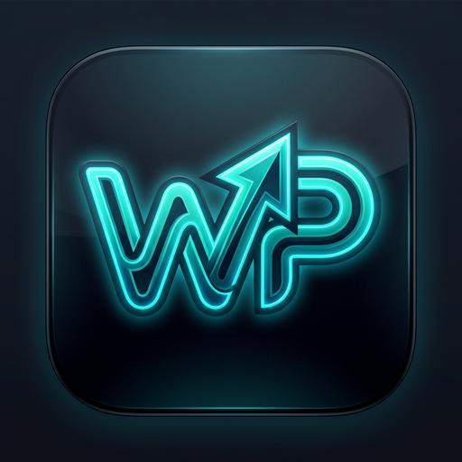
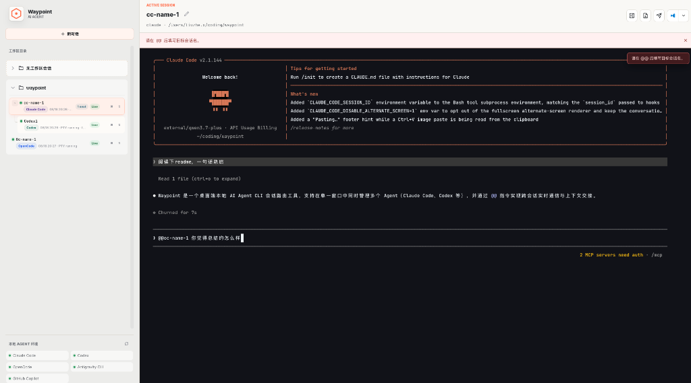

# Waypoint

<p align="center">
  
</p>

<p align="center">
  <strong>桌面端本地 AI Agent CLI 会话路由器</strong>
</p>



Waypoint 是一个专为 AI 辅助编程设计的桌面端本地 Agent CLI 会话路由与管理工具。基于 **Tauri v2 + Rust + React + Xterm.js** 构建，支持在单一窗口中管理并保持多个本地 Agent CLI（如 Claude Code、Codex、Antigravity CLI、GitHub Copilot、Shell 等）长期存活、自由切换，并提供毫秒级的跨会话协作与上下文交接（Handover）能力。

---

## ✨ 核心特性

### 1. 跨会话实时同步（`@@` 提及指令）
* **即时跨 Agent 调度**：在任意终端输入 `@@目标会话名 消息`，即可直接将任务或更新通知投递给目标 Agent。
* **带引号会话名支持**：支持包含空格的会话名，如 `@@"Security Reviewer" 请核对鉴权逻辑`。
* **避免语法冲突**：采用 `@@`（双 `@`）作为专用指令前缀，将单个 `@`（如 `@src/index.ts`）完整保留给 Agent 原生的文件与代码索引。
* **发送后自动切屏**：回车发送后，终端自动擦除指令，界面**自动平滑切换至目标 Session 并高亮工作区**，即时查看目标 Agent 的流式响应。
* **直出内联提示词（Direct Inline Prompt）**：目标 Agent 接收结构化的即时 Prompt（包含来源会话、标题与 User Note），无需读盘，适配终端 Raw 模式标准回车（`\r`）即时自动提交执行。
* **广泛的会话可见性**：支持在同一会话树（父子、深层）以及**同一工作区下独立创建的平行会话**之间相互发现与通信。

### 2. 会话接力与上下文交接（Handover）
* **New Session（会话继承）**：从源会话一键衍生出新的子会话，自动提取并格式化最近对话时间线（Timeline），将上下文完整交接给新的 Agent。
* **Existing Session（关联同步）**：向已在运行的关联会话发送任务更新或 Review 结论。
* **Copy Handover（手动交接）**：生成结构化 Handover 归档文件并复制短指令，方便跨终端手动粘贴。
* **精炼的下一步引导**：提示词直奔用户需求（User Note），避免 Agent 接收任务后盲目运行 `git diff` 等无关指令。

### 3. 多会话与多工作区管理
* **PTY 会话持久托管**：在真正的本地伪终端（PTY）中运行 Agent CLI，切换界面或最小化窗口时不杀底层进程。
* **工作区路由与无工作区模式**：支持固定项目工作区目录，也可选择「None（不绑定工作区）」作为独立全局会话。
* **树状层级拓扑**：支持父子会话嵌套展示，删除父会话时可级联删除衍生会话。

### 4. 权限确认跳过（Dangerous 模式）
* 新建会话时对 Claude Code（`--dangerously-skip-permissions`）与 Codex（`--dangerously-bypass-approvals-and-sandbox`）提供快速勾选；配置持久化至会话元数据中，在 Handover 与 Native Resume 时自动生效。

### 5. 终端截图与附件粘贴
* 在终端中直接粘贴（Cmd+V）或拖入图片，自动保存至当前工作区的 `.waypoint-attachments/` 目录；
* 在输入行插入 `[paste image N]` 占位符，回车提交前自动反解为附件的绝对物理路径，便于 Claude Code 等 Agent 准确读取。

### 6. Agent 原生状态恢复（Native Resume）
* 会话退出或应用重启后进入只读回放（Replay）模式；输入任意内容自动调用 Agent 原生命令（如 `codex resume <id>`、`claude --resume=<id>`、`agy --conversation=<id>`）重新唤醒会话。

---

## 🤖 支持的 Agent CLI

Waypoint 会在启动时通过用户的 Login Shell 自动检测以下 CLI 工具：

| Agent | 预设命令 |
| :--- | :--- |
| **Claude Code** | `claude` |
| **Codex** | `codex` |
| **OpenCode** | `opencode` |
| **Antigravity CLI** | `agy` |
| **GitHub Copilot** | `copilot`、`gh copilot` |
| **系统 Shell** | `$SHELL` (zsh / bash / fish) |

> 💡 **排查提示**：如果某个 Agent 在系统终端中可用但在 Waypoint 中显示 missing，可以在终端执行 `command -v <agent_name>` 确认是否已加入 Login Shell 的 `PATH`。

---

## 🛠️ 技术栈

* **桌面外壳**：Tauri v2 + Rust
* **前端界面**：React 18 + TypeScript + Vite + Lucide Icons
* **终端引擎**：`@xterm/xterm` + `@xterm/addon-fit`
* **PTY 托管**：`portable-pty`
* **构建产物**：macOS `.app`、`.dmg`

---

## 🚀 快速开始

### 1. 环境要求
* **macOS**：已安装 Xcode Command Line Tools (`xcode-select --install`)
* **Node.js**：v18+ 及 npm
* **Rust**：最新稳定版 (`curl --proto '=https' --tlsv1.2 -sSf https://sh.rustup.rs | sh`)

### 2. 本地开发与调试
```bash
# 1. 安装前端依赖
npm install

# 2. 启动桌面应用开发模式
npm run tauri:dev
```

### 3. 构建 DMG 安装包
```bash
npm run tauri:build
```
打包成功后，可在 `src-tauri/target/release/bundle/dmg/` 目录下获取最新的 `.dmg` 安装包。

---

## ❓ 常见问题排查

#### 1. 为什么历史会话提示无法恢复？
重启应用后，历史会话处于只读状态。恢复依赖于该 Agent 本地保存的原生 Session 标识。如果会话为旧版本创建或本地日志已被 Agent 自身清理，Waypoint 会自动提示并在当前工作区为你创建同类型的新会话。

#### 2. 浏览器打开 `http://127.0.0.1:1420/` 显示 `Tauri runtime unavailable`
此为正常现象。PTY 进程托管与本地文件系统交互依赖 Tauri 桌面底层运行时，请在桌面客户端窗口中操作。

#### 3. 执行 Handover 提示 `failed to write handover`
请确认目标 Agent CLI 是否处于正常待命状态（如未登录、启动即退出或需要交互式授权）。
