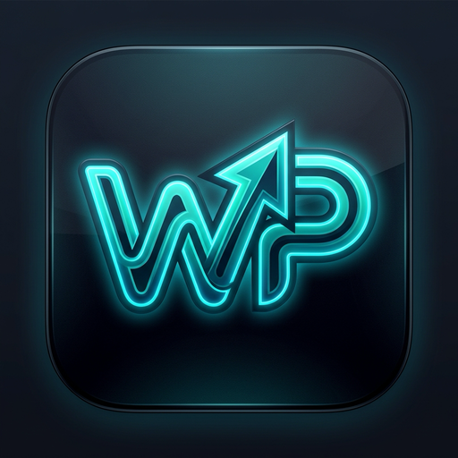
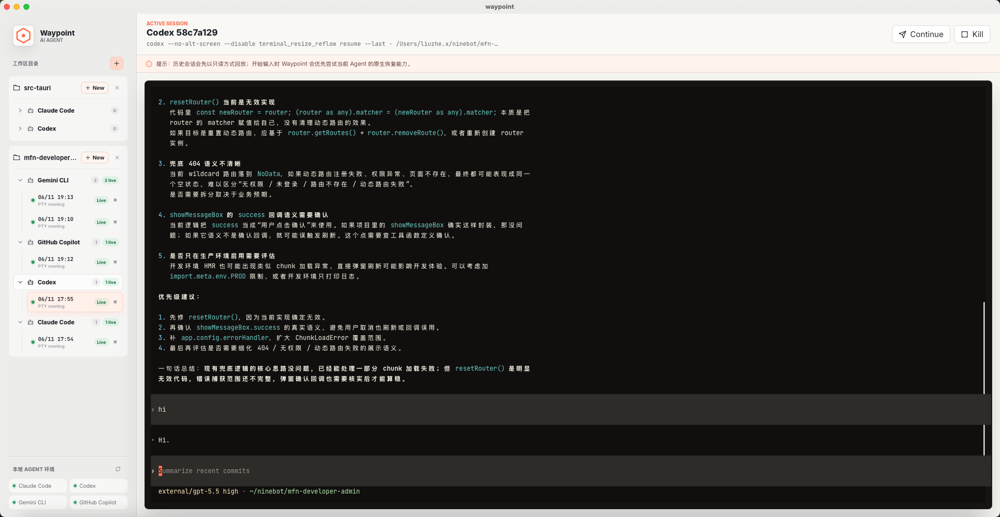

# Waypoint

<p align="center">
  
</p>

<p align="center">
  <strong>桌面端本地 Agent CLI 会话路由器。</strong>
</p>

<p align="center">
  <a href="README.md">English README</a>
</p>



waypoint 是一个桌面端本地 Agent CLI 会话路由器。它的目标是通过 Tauri + Rust 管理多个本机 PTY 会话，让 Claude Code、Codex、Antigravity CLI、GitHub Copilot、Shell 等 agent 会话可以长期存活、随时切换，并支持跨 agent 上下文交接（Handover）。

## 技术栈

- **桌面外壳**：Tauri v2 + Rust
- **前端界面**：React + TypeScript + `@xterm/xterm` + `@xterm/addon-fit`
- **PTY 托管**：`portable-pty`
- **构建工具**：Vite

---

## 当前 MVP 能力

当前版本支持：

- 自动识别本机 Agent CLI。
- 选择 agent preset 创建 session。
- 指定 workspace 目录创建 PTY session。
- 多个 session 并存，切换 UI 时不杀掉已有 PTY 进程。
- 将一个 session 的上下文转发到另一个 session。
- Xterm 终端输入、输出和 resize。

内置识别的 agent：

```text
Claude Code:
  claude

Codex:
  codex

Antigravity CLI:
  agy

GitHub Copilot:
  copilot
  gh copilot

Shell:
  $SHELL
```

检测逻辑会通过用户的 login shell 执行 `command -v`，因此比直接读取桌面进程 PATH 更接近你在 terminal 里的环境。

如果某个 agent 在 terminal 里可用，但 waypoint 里显示 missing，可以先检查：

```bash
command -v claude
command -v codex
command -v agy
command -v copilot
command -v gh
```

如果 agent 安装在自定义路径，后续版本会提供可编辑 Agent Preset；当前版本先依赖 login shell 的 PATH 自动发现。

---

## 环境准备与安装

运行 waypoint 需要本地安装有 Node.js 与 Rust 工具链。

### 1. 安装 Xcode Command Line Tools (macOS)
在终端中执行以下命令检查是否已安装：
```bash
xcode-select -p
```
如未安装，执行：
```bash
xcode-select --install
```

### 2. 安装 Rust 工具链
推荐使用 `rustup` 安装 Rust：
```bash
curl --proto '=https' --tlsv1.2 -sSf https://sh.rustup.rs | sh
```
在安装过程中选择默认选项（输入 `1`）。
安装完成后，使当前终端加载 Cargo 环境变量：
```bash
source "$HOME/.cargo/env"
```
建议在你的 Shell 配置文件（如 `~/.zshrc`）中添加：
```bash
source "$HOME/.cargo/env"
```

### 3. 验证环境安装
确认以下命令均能正常输出版本号：
```bash
node --version
npm --version
rustc --version
cargo --version
```

---

## 项目运行与启动

### 1. 安装项目依赖
在项目根目录下，安装前端依赖：
```bash
npm install
```

### 2. 启动开发模式 (桌面窗口)
```bash
npm run tauri:dev
```
此命令会同时启动 Vite 前端开发服务器与 Tauri 桌面外壳，并自动打开桌面应用窗口。
> [!IMPORTANT]
> 由于 PTY 后端运行在 Tauri 桌面进程中，在普通浏览器中（如访问 `http://127.0.0.1:1420/`）只能预览 UI 界面，无法实际创建和使用 PTY 会话。请务必在 Tauri 桌面窗口中进行操作。

### 3. 项目打包与构建 (生产包)
如果需要打包生成本地可执行的 App 安装包，执行：
```bash
npm run build
```

---

## 常见问题与排查

## 手动验收

启动桌面应用：

```bash
npm run tauri:dev
```

然后执行：

```text
1. 打开 waypoint 桌面窗口。
2. 左侧 Agent 下拉框会显示 Claude Code / Codex / Antigravity CLI / GitHub Copilot。
3. 可用 agent 会显示 resolved command，不可用 agent 会显示 missing。
4. 在 Workspace 输入本地项目目录，例如：
   /Users/liuzhe.x/coding/waypoint
5. 选择一个 available agent。
6. 点击 Start。
7. 确认右侧 terminal 启动到该目录下的对应 agent CLI。
8. 创建第二个 session，切换回来确认第一个 session 没有退出。
```

### Continue / Handover 验收

创建一个 source session 后执行：

```text
1. 切到源 session。
2. 点击右上角 Continue。
3. 默认选择 New Session。
4. 选择目标 agent。
5. Workspace 默认使用源 session 的目录，也可以手动修改。
6. 在 Note 中填写目标 agent 接下来要关注的任务。
7. 点击 Create & Continue。
8. waypoint 会创建一个新的目标 session。
9. waypoint 会收集源 session 按时间顺序排列的最近对话、workspace git status、git diff、staged diff。
10. waypoint 会生成 handover prompt，并注入新 session。
11. UI 自动切换到新 session。
12. 源 session 仍然保持运行，可以随时切回。
```

Continue 弹窗右侧的 handover Markdown 支持直接编辑；点击 Create & Continue / Forward 时会把编辑后的内容写入 handover 文件并用于注入。

如果已经有一个目标 session，也可以使用高级模式：

```text
1. 点击 Continue。
2. 切换到 Existing Session。
3. 选择目标 session。
4. 在 Note 中填写目标 agent 接下来要关注的任务。
5. 点击 Forward。
6. waypoint 会把 handover prompt 注入已有目标 session。
```

### Native session id 与恢复逻辑

waypoint 自己的 session id 存在 `~/.waypoint/sessions/<session-id>/meta.json` 中；如果某个 agent 支持原生恢复，waypoint 会在 `nativeSessionRef` 中记录该 agent 的 native id、可选 project、恢复命令和发现时间。恢复历史会话时，后端先重新解析/补全 native 信息，再生成对应 agent 的 resume 命令。

不同 agent 的 native id 策略：

```text
Claude Code:
  创建会话时，waypoint 将自己的 session id 作为 Claude 的 --session-id 注入。
  如果启动参数里已经包含 --resume/-r/--session-id，则不重复注入。
  meta.nativeSessionRef.id = waypoint session id。
  恢复前会确认 ~/.claude/projects/<workspace-as-claude-project>/<id>.jsonl 存在；
  如果标准路径不存在，会在 ~/.claude/projects 下按文件名兜底搜索 <id>.jsonl。
  恢复命令：claude --resume <id>。

Codex:
  Codex 当前不在创建时强行指定 native id。
  如果 meta 里已有 native id，恢复命令为 codex resume <id>。
  如果 meta 没有 native id，恢复命令退化为 codex resume --last。
  读取原生 transcript 时，会优先用 native id 在 ~/.codex/sessions 和
  ~/.codex/archived_sessions 里查找；如果没有 native id，则按 workspace cwd
  和 session 创建时间查找最近的 Codex transcript。

Antigravity CLI (agy):
  agy 不支持在启动时由外部指定 conversation id。
  waypoint 在 agy 第一次真实提交用户输入时，额外向 PTY 发送：
    <!-- waypoint_session_id: <waypoint-session-id> -->
  这个标记会落入 agy 的原生 transcript。
  在 agy 进程自然退出、kill/stop、恢复前，以及构建 handover 时，
  waypoint 会扫描 ~/.gemini/antigravity-cli/brain/*/.system_generated/logs/transcript.jsonl，
  grep waypoint_session_id 标记；匹配到的 brain 目录名就是 agy conversation id。
  meta.nativeSessionRef.id = agy conversation id。
  如果 waypoint 自己的终端 transcript 里出现 agy 打印的
  "Resume in the same project" 行，会解析其中的 --project=<project> 作为补充。
  恢复命令：agy --conversation=<conversation-id> [--project=<project>]。

GitHub Copilot:
  创建会话时，waypoint 将自己的 session id 作为 --session-id=<id> 注入。
  如果启动参数里已有 --continue/--resume/-r/--session-id，则不重复注入。
  对 gh copilot 形式的命令，会在必要时通过 -- 分隔 Copilot CLI 参数。
  meta.nativeSessionRef.id = waypoint session id。
  恢复命令：copilot --resume=<id> 或 gh copilot -- --resume=<id>。

Shell:
  普通 Shell 没有 agent native session id，waypoint 只保留自己的 PTY transcript 和 replay。
```

### Handover 文件生成逻辑

handover 不直接把完整上下文塞进目标 agent 的命令行。waypoint 会先生成文件，再让目标 agent 读取这个精确文件。

文件路径与模式：

```text
主文件：
  ~/.waypoint/<workspace-name>/handover-<uuid>.md

Compact 模式的完整证据文件：
  ~/.waypoint/<workspace-name>/handover-<uuid>-full-evidence.md

workspace-name：
  取 workspace 路径最后一级目录名；无法解析时使用 workspace。

模式选择：
  Recommended 模式下，如果估算上下文超过 24,000 字符，使用 Compact；
  否则使用 Full。
  用户也可以显式选择 Compact 或 Full。
```

handover 文件会收集以下信息：

```text
1. Source session / target session 的 agent、命令、workspace。
2. 用户在 Continue 面板填写的 note。
3. git branch、git status --short。
4. unstaged diff 与 staged diff 的 stat、文件列表和 diff preview。
5. 最近的 conversation timeline：尽量按原始 chat 顺序保留 User / Assistant 往返。
6. 上一跳 inherited handover context。
7. 截图/图片附件的精确路径、类型和大小。
8. agy 会话生成的 markdown artifacts：
   从 ~/.gemini/antigravity-cli/brain/<conversation-id> 读取顶层 .md 文件。
```

上下文来源优先级：

```text
Claude Code:
  优先读取 ~/.claude/projects/.../<native-id>.jsonl 原生 transcript。
  找不到时回退 waypoint 自己的 terminal/chat buffer。

Codex:
  优先读取 ~/.codex/sessions 或 archived_sessions 下匹配 native id 的 transcript。
  没有 native id 时按 workspace 与创建时间选最近 transcript。
  找不到时回退 waypoint 自己的 terminal/chat buffer。

Antigravity CLI:
  先通过 waypoint_session_id 反查 conversation id。
  再读取 ~/.gemini/antigravity-cli/brain/<conversation-id>/.system_generated/logs/transcript.jsonl。
  找不到时回退 waypoint 自己的 terminal/chat buffer。

GitHub Copilot / Shell:
  主要使用 waypoint 自己的 terminal/chat buffer 与输入 ring。
  如果无法构造有序 User / Assistant 对话，handover 会在同一个 timeline 区块中
  标明只捕获到用户输入，而不会再把 assistant/context 和 user inputs 分成两个独立区块。
```

Full 与 Compact 的差异：

```text
Full:
  主 handover 文件中包含完整结构、最近有序对话、git 状态、
  diff stat、文件列表和受限长度的 diff preview。

Compact:
  主 handover 文件只保留更短的有序对话、git 状态、diff stat 和文件列表；
  不内联完整 diff preview。
  同时生成 *-full-evidence.md，保存完整证据、完整 git diff 和 staged diff。
  Compact 主文件会引用 evidence 文件路径，目标 agent 可按需读取该精确文件。
```

### 不同 agent 的 Handover 启动/注入策略

```text
Claude Code:
  New Session 时先生成 handover 文件。
  启动命令形态：claude "<startup prompt>"。
  startup prompt 要求只读取 handover 文件，并包含新的 waypoint_session_id 标记。
  创建目标 session 后记录 parentSessionId 和 handoverRootId。

Codex:
  默认命令带 --no-alt-screen，减少嵌入式 xterm 中的 alternate screen 闪屏。
  New Session 时会把 handover 文件所在目录通过 --add-dir 加入允许访问范围。
  启动 prompt 直接指向 handover 文件，并包含新的 waypoint_session_id 标记。
  新建后等待更长启动延迟再注入，降低 Codex 尚未准备好时写入失败的概率。

Antigravity CLI (agy):
  New Session 使用 agy --prompt-interactive "<startup prompt>"。
  waypoint 会通过 --add-dir 授权 handover 文件所在目录。
  startup prompt 只包含 handover 文件路径和新的 waypoint_session_id 标记，
  避免长 diff/context 直接进入 agy TUI。

GitHub Copilot:
  New Session 使用 copilot -i "<startup prompt>"。
  handover 文件目录通过 --add-dir 传入；gh copilot 形态会通过 -- 分隔参数。

Existing Session / Forward:
  先生成 handover 文件。
  通过 PTY bracketed paste 注入一段短提示：
    只读取这个 handover 文件，确认 context loaded，然后等待下一步指令。
  注入前会检查目标进程是否已经退出；失败时错误中会带最近 target 输出。

Create Handover File:
  右上角的 handover file 按钮只生成文件，不启动/注入任何 agent。
  target 被标记为 Manual handover，适合手动复制文件路径给外部工具。
```

每次 handover 的目标 session 会记住这次 handover 摘要；如果之后继续从该目标 session 再 handover 到第三个 agent，waypoint 会把上一跳 handover 作为 inherited context 一并写入新的 handover 文件。

---

### `cargo` 或 `rustc` command not found
通常是因为当前 Shell 环境未加载 Cargo 的 PATH。请尝试执行：
```bash
source "$HOME/.cargo/env"
```
并重新检查 `rustc --version`。

### `npm run tauri:dev` 提示 Rust 未安装
同上，通常是 Tauri 未读取到 Rust 路径。你可以在项目根目录下执行以下命令来确认 Tauri 能够检测到的运行环境：
```bash
npm run tauri -- info
```
如果在输出中看到 `rustc: installed` 即代表环境检测成功。

### 浏览器中提示 `Tauri runtime unavailable`
此报错为预期行为。Tauri 的底层 API（如 PTY 会话管理、本地文件读写等）必须在编译后的桌面外壳容器中才能调用，在普通浏览器中访问会导致该错误，请使用 `npm run tauri:dev` 启动桌面端。

### Continue 时报 `failed to write handover`

这通常表示目标 agent CLI 没有进入可交互状态，或者命令启动后很快退出。waypoint 会在新建 target session 后短暂等待并重试注入 handover；如果目标进程已经退出，错误信息会包含 target session 的最近输出。

常见原因：

```text
1. 目标 CLI 需要先登录或配置 API key。
2. 目标 CLI 不是持久交互式 chat 命令，例如某些 Copilot CLI 命令只执行一次就退出。
3. 目标 CLI 启动后进入权限确认、初始化失败或帮助页后退出。
```

排查方式：

```text
1. 先直接 Start 目标 agent，确认它能保持在可输入状态。
2. 如果目标 agent 会立即退出，先解决它自己的登录/配置问题。
3. 如果该 CLI 本身不是持久交互式 agent，暂时用 Shell、Claude Code、Codex 或 Antigravity CLI 做 Continue target。
```

---

## 相关文档

* [AGENTRELAY_TECHNICAL_DESIGN.md](AGENTRELAY_TECHNICAL_DESIGN.md) - MVP 详细技术设计方案
* [AGENTRELAY_ARCHITECTURE_SUMMARY.md](AGENTRELAY_ARCHITECTURE_SUMMARY.md) - 精简版技术架构与流程说明
